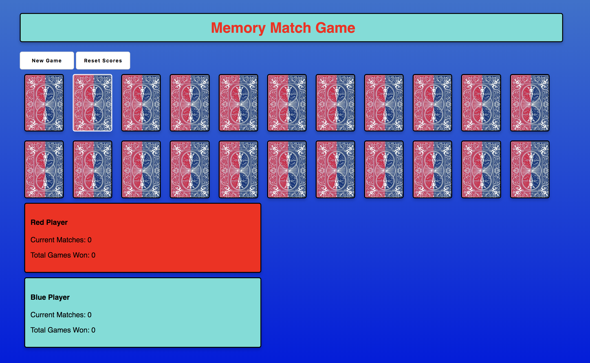

# memoryMatchGame

This is a memory test game played between two players.  Red player goes first, blue player goes second and so on.  The player with the most matches after all the cards have been flipped wins the game.

https://mquade91.github.io/memoryMatchGame/

